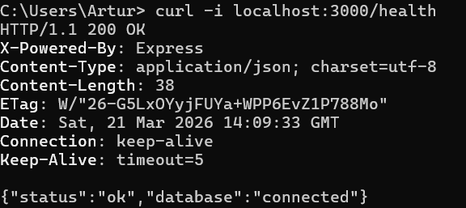
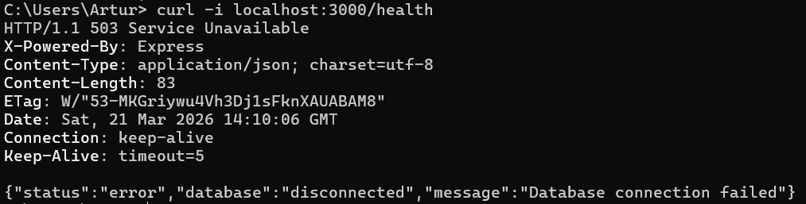
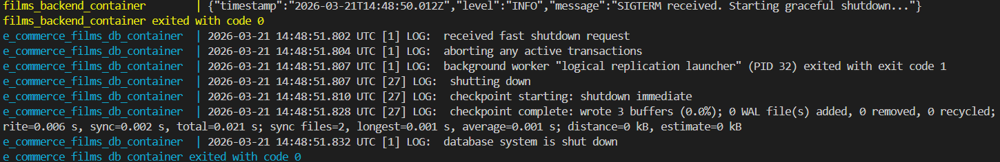

# E-commerce Films API

# Налаштування

## (Змінні оточення)

Для успішного запуску застосунку необхідно створити файл `.env` у кореневій директорії проєкту. Нижче наведено список усіх необхідних змінних:

| Змінна           | Опис                                                                               | Обов'язкова | Приклад                 |
| :--------------- | :--------------------------------------------------------------------------------- | :---------: | :---------------------- |
| `DB_HOST`        | Хост бази даних (`postgres` для Docker-мережі, `localhost` для локального запуску) |     Так     | `postgres`              |
| `DB_PORT`        | Порт для підключення до бази даних , на локалці наприклад 5433                     |     Так     | `5432`                  |
| `DB_NAME`        | Назва бази даних PostgreSQL                                                        |     Так     | `e_commerce_filmsdb`    |
| `DB_USER`        | Ім'я користувача бази даних                                                        |     Так     | `postgres`              |
| `DB_PASSWORD`    | Пароль для підключення до бази даних                                               |     Так     | `MyPassword05`          |
| `TMDB_API_KEY`   | Ключ доступу до зовнішнього API The Movie Database                                 |     Так     | `your-api-token`        |
| `JWT_SECRET`     | Секретний ключ для підпису та верифікації JWT токенів                              |     Так     | `your-super-secret-key` |
| `JWT_EXPIRES_IN` | Час життя JWT токена (у секундах)                                                  |     Так     | `3600`                  |

---

### Запуск за допомогою контейнерів

```bash
# Встановлення залежностей
npm install

```

### Запуск з беком локально

```bash
# Встановлення залежностей
npm install
# встановлення модуля прізми
npx prisma generate
# запуск бд
docker-compose up -d postgres
# виконання наявних міграцій
npx prisma migrate deploy
# заповнення стартовими даними бд
npx prisma db seed
# запуск у watch mode
npm run start:dev
```

### Запуск тестів

```bash
npm test
```

---

# Lab 0: Production-Ready Requirements

## 1. Підтвердження Health Check

Ендпоінт `GET /health` реалізує "глибоку" перевірку стану: він повертає статус `200 OK` лише за умови успішного виконання тестового запиту до бази даних. Якщо зв'язок з БД втрачено, застосунок повертає `503 Service Unavailable`.

```bash
curl -i localhost:3000/health
```

**БД підключена (200 OK):**<br>


**БД зупинена вручну (503 Service Unavailable):**


---

## 2. Приклад логів (JSON форматування)

Приклад STDOUT логів під час ініціалізації контейнера:

```json
{"timestamp":"2026-03-21T12:36:50.366Z","level":"INFO","message":"Starting Nest application..."}
{"timestamp":"2026-03-21T12:36:50.407Z","level":"INFO","message":"DatabaseModule dependencies initialized"}
{"timestamp":"2026-03-21T12:36:50.410Z","level":"INFO","message":"AppModule dependencies initialized"}
{"timestamp":"2026-03-21T12:36:50.432Z","level":"INFO","message":"Mapped {/comments, POST} route"}
{"timestamp":"2026-03-21T12:36:50.529Z","level":"INFO","message":"Nest application successfully started"}
```

---

## 3. Graceful shutdown

```json
{"timestamp":"2026-03-21T14:48:50.012Z","level":"INFO","message":"SIGTERM received. Starting graceful shutdown..."}
```



---

## API Ендпоінти

Нижче наведено перелік доступних REST API маршрутів застосунку. Деякі ендпоінти (наприклад, створення рецензій чи коментарів) захищені за допомогою JWT-авторизації.

| Метод          | Ендпоінт                     | Опис                                              | Потребує Auth |
| :------------- | :--------------------------- | :------------------------------------------------ | :-----------: |
| **Health**     |                              |                                                   |               |
| `GET`          | `/health`                    | Глибока перевірка стану системи (БД + Застосунок) |      Ні       |
| **Auth**       |                              |                                                   |               |
| `POST`         | `/auth/register`             | Реєстрація нового користувача                     |      Ні       |
| `POST`         | `/auth/login`                | Авторизація користувача та отримання JWT токена   |      Ні       |
| **Films**      |                              |                                                   |               |
| `GET`          | `/films`                     | Отримання списку всіх фільмів                     |      Ні       |
| `GET`          | `/films/:id`                 | Отримання детальної інформації про фільм за ID    |      Ні       |
| `POST`         | `/films`                     | Додавання нового фільму                           |      Так      |
| **Users**      |                              |                                                   |               |
| `GET`          | `/users`                     | Отримання списку користувачів                     |      Так      |
| `GET`          | `/users/:id`                 | Отримання профілю користувача за ID               |      Так      |
| `POST`         | `/users`                     | Створення користувача                             |      Ні       |
| `PATCH`        | `/users/:id`                 | Оновлення даних користувача                       |      Так      |
| `DELETE`       | `/users/:id`                 | Видалення користувача                             |      Так      |
| **Reviews**    |                              |                                                   |               |
| `GET`          | `/reviews`                   | Отримання списку всіх рецензій                    |      Ні       |
| `GET`          | `/reviews/:id`               | Отримання конкретної рецензії                     |      Ні       |
| `POST`         | `/reviews`                   | Створення нової рецензії                          |      Так      |
| `PATCH`        | `/reviews/:id`               | Оновлення власної рецензії                        |      Так      |
| `DELETE`       | `/reviews/:id`               | Видалення власної рецензії                        |      Так      |
| **Comments**   |                              |                                                   |               |
| `GET`          | `/comments`                  | Отримання списку всіх коментарів                  |      Ні       |
| `GET`          | `/comments/:id`              | Отримання конкретного коментаря                   |      Ні       |
| `POST`         | `/comments`                  | Створення нового коментаря до рецензії            |      Так      |
| `PATCH`        | `/comments/:id`              | Оновлення власного коментаря                      |      Так      |
| `DELETE`       | `/comments/:id`              | Видалення власного коментаря                      |      Так      |
| **Ratings**    |                              |                                                   |               |
| `GET`          | `/ratings`                   | Отримання всіх оцінок                             |      Ні       |
| `GET`          | `/ratings/movie/:movieId/me` | Отримання власної оцінки для конкретного фільму   |      Так      |
| `POST`         | `/ratings`                   | Встановлення оцінки фільму                        |      Так      |
| `PATCH`        | `/ratings/:id`               | Зміна встановленої оцінки                         |      Так      |
| `DELETE`       | `/ratings/:id`               | Видалення своєї оцінки                            |      Так      |
| **Favourites** |                              |                                                   |               |
| `GET`          | `/favourites/:userId`        | Отримання списку улюблених фільмів користувача    |      Так      |
| `POST`         | `/favourites`                | Додавання фільму до списку улюблених              |      Так      |
| `DELETE`       | `/favourites/:id`            | Видалити фільм зі списку улюблених                |      Так      |
